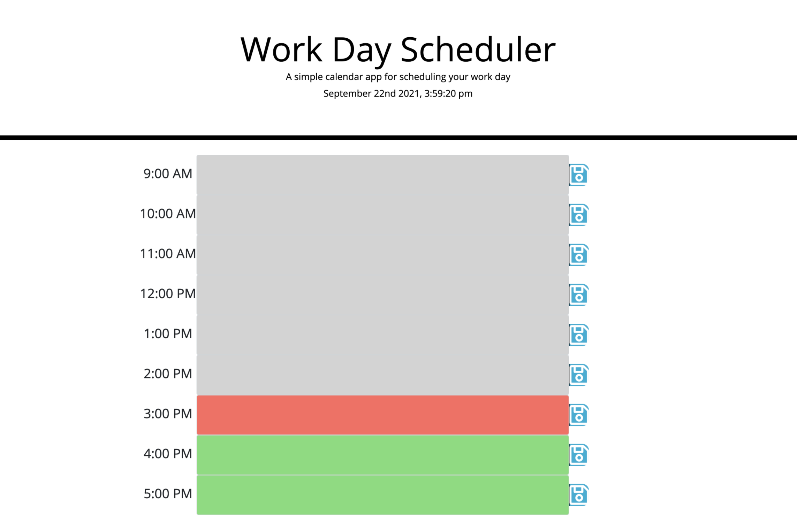

# 05 Third-Party APIs: Work Day Scheduler

## User Story

```md
AS AN employee with a busy schedule
I WANT to add important events to a daily planner
SO THAT I can manage my time effectively
```

## Description
* Once the scehduler is opened in broswer choice, the the current day & time will displayed at the top of the scheduler
* When you scroll down you will find the workday time slots, which you can then enter task with the appropriate time slot in the input provided.
* Once you have entered the task, press save & the scheduler will store the task in local storage & save on schedule. 

## Example
The following image demonstrates the application functionality:




# Installation
1. Launch [LexMastro GitHub](https://github.com/LexMastro) & select 'workday-scheduler' repository

2. Clone the repository 
```bash
git clone git@github.com:LexMastro/workday-scheduler/.git
```
2. Open `index.html` in web browser to use Scheduler.


## License 
This project is licensed under the [MIT License](LICENSE)